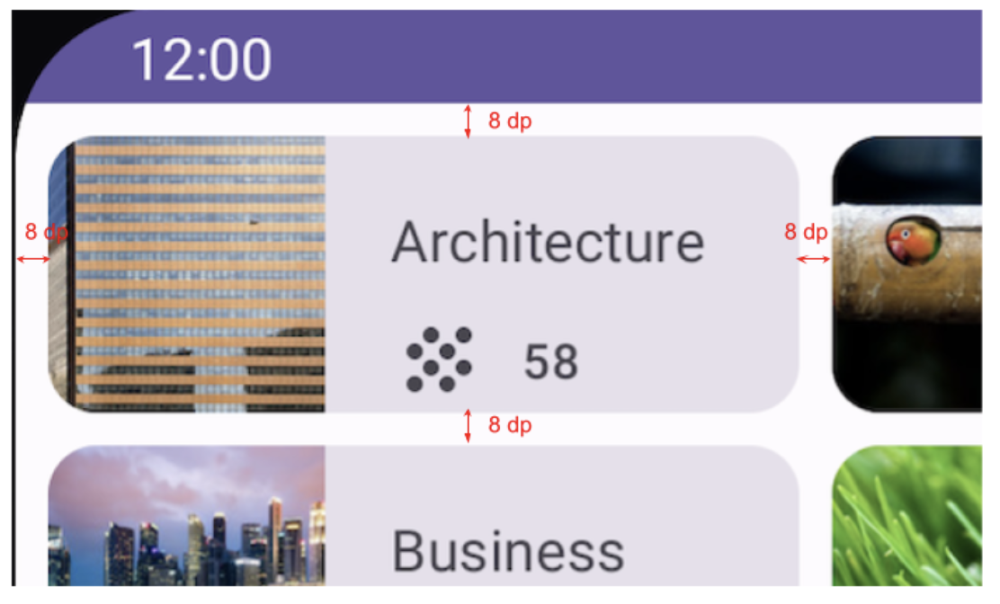
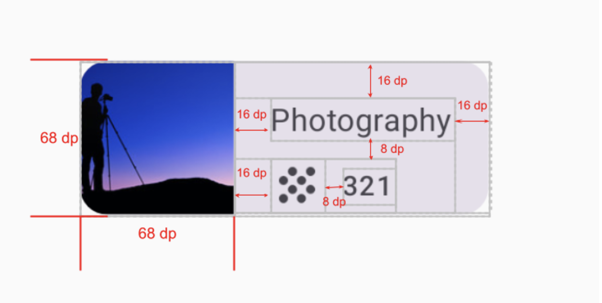

# Grid Layout App

This project is built using Jetpack Compose as part of the Android Basics in Kotlin course. It demonstrates the use of grid layouts in a Compose-based UI and follows the practice from [this Codelab](https://developer.android.com/codelabs/basic-android-kotlin-compose-practice-grid).

## Project Overview

The **Grid Layout App** showcases how to implement a grid-based layout for displaying content in a visually appealing and responsive format. This is achieved using composables like `LazyVerticalGrid`, `Card`, and `Text`, enabling efficient rendering of items.

## Features

- **Grid Layout**: The app uses `LazyVerticalGrid` to present data in a grid format, ideal for showcasing items like images, product listings, or categories.
- **Composables**: Key composables used include `Card`, `Text`, and `LazyVerticalGrid`, which allow for a modular and flexible UI structure.
- **Custom Styling**: Applied custom colors, spacing, and typography to ensure the app is aesthetically pleasing and easy to navigate.
- **Efficient UI**: Grid layouts help optimize the screen space and make the user experience more intuitive, especially for large datasets or galleries.

## Technologies Used

- **Jetpack Compose**: A modern Android UI toolkit that simplifies and accelerates UI development on Android.
- **Kotlin**: The primary language used for Android development.
- **Material Design Components**: Integrated for a sleek, consistent design throughout the app.

## Screenshots

<div align="center">

<!-- Potrait Mode -->

<p style="text-align:center;"> The App Main Screen. </em></p>

<!-- UISpecs -->

<p style="text-align:center;"><em>UI Specs(via Google CodeLabs)</em></p>
<!-- card Dimensions-->

<p style="text-align:center;"><em>Card Dimensions (via Google CodeLabs)</em></p>


</div>

## Getting Started

### Prerequisites

- Android Studio installed with Kotlin support.
- Basic understanding of Android development and Jetpack Compose.

### Installation

1. Clone this repository:

   ```bash
   git clone https://github.com/your-username/MyGridApp.git
 

2. Open the project in Android Studio.

3. Build and run the app on an Android device or emulator.

### How to Use
- The app displays content in a grid format.
- You can add more items to the grid by modifying the provided data set in the MainActivity.kt file.
  :bulb: **Note:** The ic_grain.xml provided in the Google Codelab was not working so a different icon is available on the mainscreen rather than the one provided on Codelab .
   
